# Documentation

```mermaid
---
title: Modèle logique
config:
  theme: forest
---
erDiagram
    Projet 1+ to 0+ Laboratoire  : "Laboratoire par Projet"
    Laboratoire 1 to 0+ LABEL : "Labels des laboratoires"
    Projet 1+ to 0+ Institution  : "Institution par Projet"
    Institution 1 to 0+ _LABEL : "Labels des institutions"
    Projet 1 to 1+ "Membre par Projet" : ""
    "Membre par Projet" 1+ to 1 Membre : ""
    Membre 1+ to 0+ CNU          : "Membre par CNU"
    Membre 1+ to 0+ "Mot clé"    : "Membre par Mot clé"
    Projet 1+ to 0+ "Partenaire socioeconomique" : "Partenaire socioeco par Projet"
    "Partenaire socioeconomique" 1 to 0+ LABEL_ : "Labels des partenaires socioeconomiques"

    Projet {
        Text        ID_PROJET       PK
        Choice      TYPE
        Text?       NOM_FR          UK
        Text?       NOM_EN          UK
        Toggle      FINANCE
        Choice?     NOTE
        Choice?     DEFI_PRINCIPALE
        Toggle?     DEFI_1
        Toggle?     DEFI_2
        Toggle?     DEFI_3
        Toggle?     DEFI_4
        Toggle?     DEFI_5
        Toggle?     DEFI_6
        Numeric     BUDGET
        Text?       COMMENTAIRE
    }

    Laboratoire {
        Text        ID_UNITE                        PK
        Text?       numero_national_de_structure    UK
        Text?       libelle
        Text?       sigle
        Numeric?    annee_de_creation
        Choice?     type_de_structure
        Numeric?    code_de_type_de_structure
        Numeric?    code_de_niveau_de_structure
        Numeric?    code_postal
        Text[]?     label_numero                        "Les numeros de l'unité"
        Text[]?     code_domaine_scientifique
        Text[]?     domaine_scientifique
        Text[]?     code_panel_erc
        Text[]?     panel_erc
    }

    Institution {
        Text        ID_INSTITUTION      PK
        Numeric?    siret               UK
        Numeric?    siren               UK
        Text?       libelle
        Text?       nom_complet
        Numeric?    nature_juridique
        Numeric?    latitude
        Numeric?    longitude
        Text?       libelle_commune
        Numeric?    code_postal
        Numeric?    region
    }

    "Partenaire socioeconomique" {
        Text        ID_PARTENAIRE       PK
        Numeric?    siret               UK
        Numeric?    siren               UK
        Text?       libelle
        Text?       nom_complet
        Text?       activities
        Numeric?    nature_juridique
        Numeric?    latitude
        Numeric?    longitude
        Text?       libelle_commune
        Numeric?    code_postal
        Numeric?    region
        Text?       COMMENTAIRE
    }

    Membre {
        Text        ID_MEMBRE   PK
        Toggle      ACTIVE
        Text?       PRENOM
        Text?       NOM
        Text?       EMAIL       UK
        Choice?     GENRE
        Text?       ORCID       UK
        Text?       IDHAL       UK
        Text?       IDREF       UK
        Text?       SITE
    }

    "Membre par Projet" {
        Text      MEMBRE    PK,FK
        Choice?   POSITION  PK
        Text      PROJET    PK,FK
    }
```

## Researcher data model refactoring process

### Migrate `POSITION` to `ROLE` and `TITLE`

Initial position values:

- Responsable scientifique et technique
- Responsable Éditorialisation et documentation
- Responsable de Service
- Responsable de département R&D
- Professeur.e émérite
- Professeur.e associé.e
- Professeur.e
- Praticien hospitalier
- PRAG (personnels enseignants du second degré affectés dans le supérieur)
- Post-doctorant.e
- porteur de projet
- physicien.ne CNAP
- Personnel support
- Maître-sse de Conférences
- Ingénieure de recherche
- Ingénieur.e de recherche
- Ingénieur.e d'études
- Ingénieur R&D
- responsable de service
- Ingénieur de Recherche
- Gestionnaire
- Doctorant.e
- Docteur.e
- directeur/directrice
- Directeur.trice technique
- Directeur.trice opérationnel
- Directeur.trice de recherche
- Directeur.trice Chef.fe de projet
- Copilote du Programme
- Conseiller Scientifique
- coencadrant/coencadrante
- codirecteur/codirectrice
- Co-pilote de projet
- Chercheure
- Chercheur.e associé.e
- Cheffe de projet
- Cheffe de programme
- Chef.fe de projet
- Chargée de mission data
- Chargé.e de recherches
- Chargé.e de communication
- Chargé.e d'études
- chargé.e d'études
- chargé.e d'appui aux projets de recherche
- Chargé de communication scientifique
- Attaché Temporaire d'Enseignement de Recherche (ATER)
- Assistante de communication
- Assistante administrative et financière
- Assistant.e ingénieur.e
- Assistant de direction
- Technicien.ne
- Secrétaire Général

```mermaid
flowchart LR

  %% identified roles

  Responsable_scientifique_et_technique --> RESPONSABLE_SCIENTIFIQUE_ET_TECHNIQUE
  directeur/directrice --> CHEF.FE_DE_PROJET
  porteur_de_projet --> RESPONSABLE_SCIENTIFIQUE_ET_TECHNIQUE
  Directeur.trice__Chef.fe_de_projet --> CHEF.FE_DE_PROJET
  Co-pilote_de_projet --> CHEF.FE_DE_PROJET
  Cheffe_de_projet --> CHEF.FE_DE_PROJET
  Cheffe_de_programme --> CHEF.FE_DE_PROJET
  Chef.fe_de_projet --> CHEF.FE_DE_PROJET

  %% AAP 1 status

  Ingénieur.e_d'études --> STATUS
  Ingénieur.e_de_recherche --> STATUS
  Maître-sse_de_Conférences --> STATUS
  Professeur.e --> STATUS
  Directeur.trice_de_recherche --> STATUS
  Professeur.e_associé.e --> STATUS
  Chargé.e_de_recherches --> STATUS
  PRAG_(personnels_enseignants_du_second_degré_affectés_dans_le_supérieur) --> STATUS
  Chercheur.e_associé.e --> STATUS
  Chef.fe_de_projet --> STATUS
  Doctorant.e --> STATUS
  Praticien_hospitalier --> STATUS
  Personnel_support --> STATUS
  chargé.e_d'appui_aux_projets_de_recherche --> STATUS
  Post-doctorant.e --> STATUS
  Assistant.e_ingénieur.e --> STATUS
  Professeur.e_émérite --> STATUS
  Chargé.e_d'études --> STATUS
  physicien.ne_CNAP --> STATUS
  Chargé.e_de_communication --> STATUS
  Docteur.e --> STATUS
  Directeur.trice_technique --> STATUS
  Responsable_de_Service --> STATUS
  Responsable_de_département_R&D --> STATUS
  Ingénieur_R&D --> STATUS
  Directeur.trice_opérationnel --> STATUS
  Attaché_Temporaire_d'Enseignement_de_Recherche_(ATER) --> STATUS
  Conseiller_Scientifique --> STATUS

  %% other = mission titles

  Gestionnaire --> TITRE
  Copilote_du_Programme --> TITRE
  coencadrant/coencadrante --> TITRE
  codirecteur/codirectrice --> TITRE
  Chercheure --> TITRE
  Chargée_de_mission_data --> TITRE
  Chargé_de_communication_scientifique --> TITRE
  Assistante_de_communication --> TITRE
  Assistante_administrative_et_financière --> TITRE
  Assistant_de_direction --> TITRE
  Technicien.ne --> TITRE
  Secrétaire_Général --> TITRE

  subgraph ROLE
    CHEF.FE_DE_PROJET
    RESPONSABLE_SCIENTIFIQUE_ET_TECHNIQUE
    RESPONSABLE_DE_TÂCHE
  end

%% CHEF.FE_DE_PROJET, RESPONSABLE_SCIENTIFIQUE_ET_TECHNIQUE, RESPONSABLE_DE_TÂCHE
%% TITRE : [permanent, non-permanent] -> [researcher, administratif]
%% WP leader


%% coencadrant/coencadrante
%% codirecteur/codirectrice
%% porteur de projet
%% directeur/directrice
```

```mermaid
flowchart LR
  Responsable_scientifique_et_technique --> CHERCHEUR.E
  Responsable_Éditorialisation_et_documentation --> INGENIEUR.E
  Responsable_de_Service --> CHERCHEUR.E
  Responsable_de_département_R&D --> CHERCHEUR.E
  Professeur.e_émérite --> CHERCHEUR.E
  Professeur.e_associé.e --> CHERCHEUR.E
  Professeur.e --> CHERCHEUR.E
  Praticien_hospitalier --> CHERCHEUR.E
  PRAG_(personnels_enseignants_du_second_degré_affectés_dans_le_supérieur) --> CHERCHEUR.E
  Post-doctorant.e --> CHERCHEUR.E
  porteur_de_projet --> CHERCHEUR.E
  physicien.ne_CNAP --> CHERCHEUR.E
  Personnel_support --> CHERCHEUR.E
  Maître-sse_de_Conférences --> CHERCHEUR.E
  Ingénieure_de_recherche --> INGENIEUR.E
  Ingénieur.e_de_recherche --> INGENIEUR.E
  Ingénieur.e_d'études --> INGENIEUR.E
  Ingénieur_R&D --> INGENIEUR.E
  responsable_de_service --> CHERCHEUR.E
  Ingénieur_de_Recherche --> INGENIEUR.E
  Gestionnaire --> CHERCHEUR.E
  Doctorant.e --> CHERCHEUR.E
  Docteur.e --> CHERCHEUR.E
  directeur/directrice --> CHERCHEUR.E
  Directeur.trice_technique --> CHERCHEUR.E
  Directeur.trice_opérationnel --> CHERCHEUR.E
  Directeur.trice_de_recherche --> CHERCHEUR.E
  Directeur.trice__Chef.fe_de_projet --> CHERCHEUR.E
  Copilote_du_Programme --> CHERCHEUR.E
  Conseiller_Scientifique --> CHERCHEUR.E
  coencadrant/coencadrante --> CHERCHEUR.E
  codirecteur/codirectrice --> CHERCHEUR.E
  Co-pilote_de_projet --> CHERCHEUR.E
  Chercheure --> CHERCHEUR.E
  Chercheur.e_associé.e --> CHERCHEUR.E
  Cheffe_de_projet --> CHERCHEUR.E
  Cheffe_de_programme --> CHERCHEUR.E
  Chef.fe_de_projet --> CHERCHEUR.E
  Chargée_de_mission_data --> CHERCHEUR.E
  Chargé.e_de_recherches --> CHERCHEUR.E
  Chargé.e_de_communication --> CHERCHEUR.E
  Chargé.e_d'études --> CHERCHEUR.E
  chargé.e_d'études --> CHERCHEUR.E
  chargé.e_d'appui_aux_projets_de_recherche --> CHERCHEUR.E
  Chargé_de_communication_scientifique --> ADMINISTRATIF
  Attaché_Temporaire_d'Enseignement_de_Recherche_(ATER) --> CHERCHEUR.E
  Assistante_de_communication --> ADMINISTRATIF
  Assistante_administrative_et_financière --> ADMINISTRATIF
  Assistant.e_ingénieur.e --> INGENIEUR.E
  Assistant_de_direction --> ADMINISTRATIF
  Technicien.ne --> INGENIEUR.E
  Secrétaire_Général --> ADMINISTRATIF

  subgraph STATUS_TYPE
    CHERCHEUR.E
    INGENIEUR.E
    ADMINISTRATIF
  end

%% coencadrant/coencadrante
%% codirecteur/codirectrice
%% porteur de projet
%% directeur/directrice
```




